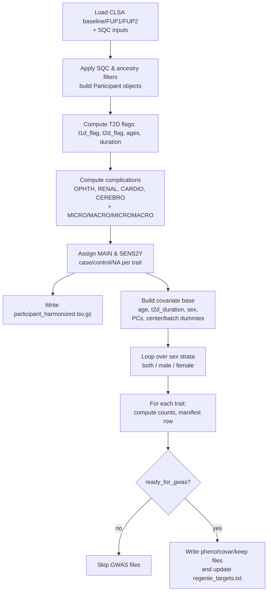

# CLSA T2D Complications Phenotype Curation

## Script

`01.curate_t2d_complications.py`

## What it does

- Loads CLSA phenotype data from baseline, FUP1, and FUP2.
- Joins CLSA genotype/sample QC metadata (`clsa_sqc_v3.txt`) via `ADM_GWAS3_COM` (baseline) / `ADM_GWAS_COM` (SQC).
- Applies OA-like GWAS QC filters for the analysis subset:
  - ancestry cluster (`pca.cluster.id`, default `4` = `EUR` per prior OA project)
  - sex concordance (`SEX_ASK_COM` vs `chromosomal.sex`)
  - `in.hetmiss == 0`
  - `in.kinship == 0`
- Curates T2D complications phenotypes (binary case/control for GWAS):
  - `OPHTH`, `RENAL`, `CARDIO`, `CEREBRO`, `MICRO`, `MACRO`, `MICROMACRO`
  - `MAIN` and `SENS2Y` (sensitivity requiring complication age at least 2 years after T2D age)
- Writes `Regenie`-ready `pheno`, `covar`, and `keep` files with:
  - shared controls across traits within ancestry × sex stratum
  - covariates: age at baseline, **T2D duration**, sex (overall only), PCs 1–10, center dummies, batch dummies.
- Writes a manifest with case/control counts and a `regenie_targets.txt` list.

## Phenotype curation flow (high level)

### Stepwise description

- **1. Load inputs**
  - Read baseline, FUP1, and FUP2 CLSA phenotype CSVs (selected columns only).
  - Read SQC file (`clsa_sqc_v3.txt`) with batch, ancestry cluster, sex, kinship, het/missingness, and PCs.

- **2. Build analysis subset**
  - Join baseline rows to SQC using `ADM_GWAS3_COM` ↔ `ADM_GWAS_COM`.
  - Derive `sex_regenie` from self-reported sex (`SEX_ASK_COM` → 0/1).
  - Apply QC/ancestry filters:
    - required SQC fields present and valid,
    - `pca.cluster.id == --pca-cluster-id` (default 4 = EUR),
    - `in.kinship == 0`, `in.hetmiss == 0`,
    - chromosomal sex consistent with reported sex.
  - Keep one `Participant` object per QC-passing individual, with attached baseline/FUP1/FUP2 rows and SQC row.

- **3. Define T2D status and timing**
  - Use `DIA_TYPE_*` to flag Type 1 vs Type 2; default requires explicit **Type II** at baseline/FUP1.
  - Optionally (`--allow-t2d-without-type2`), allow diabetes + meds or HbA1c ≥ 6.5 in the absence of Type I evidence.
  - Derive:
    - `t2d_flag`, `t1d_flag`,
    - `t2d_age` (earliest available age at diagnosis),
    - `last_obs_age` (latest observed age across waves),
    - `t2d_duration = last_obs_age − t2d_age`.

- **4. Define complication domains**
  - **OPHTH**: diabetic retinopathy only (FUP1/FUP2 `DIA_DIABRT_*` + ages).
  - **RENAL**: kidney disease/failure and/or dialysis (baseline/FUP1/FUP2).
  - **CARDIO**: heart disease, angina, MI, CAB/revascularization, PVD, and hypertension (`CCC_HBP_COM` / `CCC_HBP_COF1`).
  - **CEREBRO**: stroke/CVA, TIA, and residual effects of stroke/TIA.
  - Combine into:
    - `MICRO` = OPHTH ∪ RENAL (no neuro in CLSA, so partial),
    - `MACRO` = CARDIO ∪ CEREBRO,
    - `MICROMACRO` = MICRO ∪ MACRO.

- **5. Case/control assignment per trait**
  - Mark **control-eligible** T2D participants:
    - T2D, not Type 1, no complications in any domain, and `t2d_duration ≥ --min-control-t2d-years` (default 2).
  - For each complication domain and composite:
    - **MAIN** case: T2D, not Type 1, domain-specific complication present, and when both ages known, complication age ≥ T2D age.
    - **SENS2Y** case: MAIN case **and** complication age ≥ T2D age + `--min-case-gap-years` (default 2); drops cases with unknown timing.
  - For each trait (`*_MAIN`, `*_SENS2Y`), set:
    - 1 = case, 0 = shared T2D control, NA = excluded.
  - Explicitly set `NEURO_*` traits to NA (not available in CLSA mapping).

- **6. Harmonized participant table**
  - Write `participant_harmonized.tsv.gz` with:
    - IDs, sex, ages, T1D/T2D flags, T2D timing, each complication domain flag/age,
    - HbA1c, creatinine, albumin,
    - all trait values in `TRAITS_ORDER`.

- **7. Covariate construction**
  - For each participant, build a covariate row with:
    - `FID`, `IID`, `age`, `sex`, `t2d_duration` (or `"NA"`),
    - PCs 1–10 from SQC,
    - center dummies: one-hot for all observed centers **except one reference** (to avoid collinearity),
    - batch dummies: one-hot for all observed batches **except one reference**.

- **8. Analysis-level outputs**
  - Loop over sex strata: `both`, `male`, `female`.
  - Within each stratum:
    - Identify shared T2D controls (`control_eligible == 1`).
    - For each trait in `TRAITS_ORDER`:
      - collect case IDs (value == 1),
      - compute `n_cases`, `n_controls`, `n_total`,
      - determine `ready_for_gwas` (available, ≥ `--min-cases-for-target`, and controls > 0),
      - record a row in `phenotype_manifest.tsv` with notes about CLSA-specific compromises (partial MICRO, retinopathy-only OPHTH, broad RENAL).
      - if ready:
        - write `*_pheno.tsv` (FID, IID, trait),
        - write `*_covar.tsv`:
          - columns: `FID`, `IID`, `age`, `t2d_duration`, PCs, dummies, and **sex only for `both`**,
        - write `*_FIDIID_noheader.tsv` keep file,
        - append analysis ID to `regenie_targets.txt`.

### Flow chart



### Comprehensive flowchart (code-aligned)

The following diagram reflects the order of operations in `01.curate_t2d_complications.py`: data load, QC, T2D/complication derivation, case–control assignment, and output writing.

```mermaid
flowchart TD
  subgraph load["1. Load inputs"]
    L1[Load baseline CSV<br/>selected columns]
    L2[Load FUP1 CSV]
    L3[Load FUP2 CSV]
    L4[Load SQC file<br/>clsa_sqc_v3.txt]
  end

  subgraph join["2. Build participants"]
    J1[For each entity_id in baseline]
    J2[Match gwasid to SQC<br/>ADM_GWAS3_COM to ADM_GWAS_COM]
    J3[Attach baseline, FUP1, FUP2, SQC row]
    J4[Derive sex_regenie from SEX_ASK_COM]
  end

  subgraph qc["3. QC filters"]
    Q1[all_covar_present]
    Q2[pca.cluster.id equals target]
    Q3[in.kinship 0, in.hetmiss 0]
    Q4[chromosomal.sex vs reported sex]
  end

  subgraph t2d["4. T2D flags"]
    T1["DIA_TYPE: 1 = T1D, 2 = T2D"]
    T2[Optional: diabetes + meds or HbA1c at least 6.5]
    T3[t2d_age, last_obs_age, t2d_duration]
  end

  subgraph comp["5. Complication domains"]
    C1[OPHTH: DIA_DIABRT FUP1/FUP2]
    C2[RENAL: kidney + dialysis CCC_*]
    C3[CARDIO: heart, angina, MI, CAB, PVD, HBP]
    C4[CEREBRO: CVA, TIA, CVAFX]
    C5[MICRO = OPHTH or RENAL<br/>MACRO = CARDIO or CEREBRO<br/>NEURO = unavailable]
  end

  subgraph assign["6. Case/control per trait"]
    A1[control_eligible: T2D, no comp, duration at least 2y]
    A2[MAIN case: comp present, comp_age at or after t2d_age]
    A3[SENS2Y case: MAIN and comp_age at least 2y after t2d_age]
    A4[Per-trait: 1 case, 0 control, NA exclude]
  end

  subgraph out["7. Outputs"]
    O1[participant_harmonized.tsv.gz]
    O2[covar_base: age, t2d_duration, sex, PCs, center/batch dummies]
    O3[Loop strata: both, male, female]
    O4[Per trait: counts, manifest row, ready_for_gwas]
    O5[If ready: pheno, covar, keep files + regenie_targets.txt]
  end

  load --> join
  join --> qc
  qc --> t2d
  t2d --> comp
  comp --> assign
  assign --> out
```



## Current CLSA-specific assumptions / limitations

- **T2D ascertainment**
  - Primarily self-report diabetes with **Type II evidence** (baseline/FUP1 `DIA_TYPE_* == 2`).
  - Optional lenient mode (`--allow-t2d-without-type2`) allows diabetes + meds or HbA1c ≥ 6.5, provided there is no Type I evidence.
  - No ICD / registry linkage is used in this script.
- **Ophthalmic (`OPHTH`)**
  - Uses **explicit diabetic retinopathy** (`DIA_DIABRT_*`) from FUP1/FUP2.
  - Functions as a **retinopathy-only proxy**; broader ophthalmic complications (cataract, glaucoma, macular edema) are not captured.
- **Neurological**
  - No clear diabetic neuropathy variables were identified in the CLSA dictionaries reviewed.
  - Neurological diabetic complication phenotypes are marked unavailable; `MICRO` therefore combines **ophthalmic + renal only** (partial relative to the consortium definition).
- **Renal (`RENAL`)**
  - Broad definition based on self-reported **kidney disease/failure** and/or **dialysis** among T2D participants.
  - Lab values (creatinine, albumin) are retained in the harmonized table but are **not** used for DKD/CKD case definition in this script.
- **Cardiovascular (`CARDIO`)**
  - Includes heart disease, angina, MI, CAB/revascularization, PVD, and **hypertension** (`CCC_HBP_COM` / `CCC_HBP_COF1`).
  - FUP2 CoPv3 appears to lack a PVD variable; PVD is therefore taken from baseline/FUP1 only.
- **Timing rules**
  - `MAIN` analyses require that, when both ages are known, complication age is **not earlier** than T2D age (to avoid reverse ordering).
  - `SENS2Y` analyses require complication age ≥ T2D age + 2 years and drop cases with unknown timing.

## Outputs

All outputs are written under `01.phenotype/output/`.

Key files:

- `phenotype_manifest.tsv`: per-analysis case/control counts, readiness flag, and notes on CLSA-specific departures (e.g. MICRO partial, retinopathy-only OPHTH, broad RENAL).
- `regenie_targets.txt`: one analysis ID per line (used by `02.regenie/*/run_*.sh`).
- `participant_harmonized.tsv.gz`: auditing table with harmonized flags, trait assignments, and lab values (HbA1c, creatinine, albumin).
- `*_pheno.tsv`, `*_covar.tsv`, `*_FIDIID_noheader.tsv`: Regenie inputs.

## Run

```bash
python3 01.phenotype/01.curate_t2d_complications.py
```

Optional example (lenient T2D rule):

```bash
python3 01.phenotype/01.curate_t2d_complications.py --allow-t2d-without-type2
```
